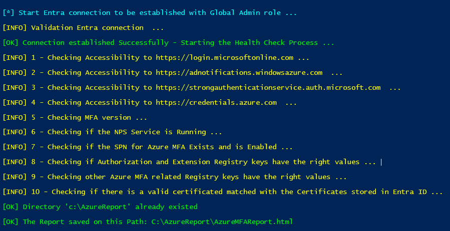

# Change

## [Unreleased] – 2025-11-15

## **Overview**

This update introduces significant improvements across MFA endpoint testing, logging standardization, and module management functions. The goal is to enhance reliability, reduce duplicated logic, and streamline test.

## **Improvements**

### **Endpoint Testing Enhancements**

* Added **TCP-based fallback testing** using `Test-TcpConnection` when `Test-NetConnection` or ICMP is unavailable.
* Added **DNS resolution fallback** using `Test-DnsResolution` to validate name resolution independently of other tests.
* Added **Get-WebRequestStatusCode** to handle URLs that return misleading HTTP responses, such as “Forbidden” or “API Method Not Found.” Some Microsoft MFA endpoints (except login.microsoftonline.com) do not return an actual HTTP status code as expected when using `invoke-WebRequest`

  | Endpoint                                                 | StatusCode | StatusDescription |
  | -------------------------------------------------------- | ---------- | ----------------- |
  | `https://adnotifications.windowsazure.com`               | Forbidden  | Forbidden         |
  | `https://strongauthenticationservice.auth.microsoft.com` | Forbidden  | Forbidden         |
  | `https://credentials.azure.com`                          | NotFound   | NotFound          |
  | `https://login.microsoftonline.com`                      | 200        | OK                |

### **Standardized Logging**

* Introduced the `Write-Message` helper function to standardize:

  * Colored output
  * Inline/no-newline formatting
  * Consistent message structure
* Replaces scattered `Write-Host` usage across the script.

### **Module Management Improvements**

* Consolidated Microsoft Graph module validation and installation into **Manage_Script_Libraries**:

  * Checks for required modules
  * Automatically installs missing components
  * Imports modules cleanly

### **Microsoft Graph Connectivity**

* Introduced **`Connect-MgGraphEndpoint`**, which:

  * It first calls `Manage_Script_Libraries` function to Validates required modules
  * Connects to the appropriate Microsoft Graph cloud

## **New Functions**

### **`Write-Message`**

Centralized, color-coded output handling for all message types. Ensures consistent formatting and readability across all functions.

### **`Connect-MgGraphEndpoint`**

Validates Microsoft Graph dependencies and establishes connections to the appropriate cloud endpoint.

### **`Test-TcpConnection`**

Performs TCP connectivity tests using `System.Net.Sockets.TcpClient` as a fallback when `Test-NetConnection` or ICMP is restricted.

### **`Test-DnsResolution`**

Performs DNS resolution using `Resolve-DnsName`, ensuring hostnames can be resolved even when ICMP or TCP tests cannot run.

### **`Get-WebRequestStatusCode`**

Checks web endpoints for reachability and handles ambiguous responses, including **403 Forbidden** and **API Method Not Found**, returning a reliable success/failure result.

* **403 Forbidden** returning a misleading status
* **API Method Not Found** on certain Azure endpoints
  Returns a reliable success/failure for web-accessibility checks.

## **Updated Functions**

### **Manage_Script_Libraries**

Now streamlined to:

* Validate all required Microsoft Graph modules
* Install any missing modules
* Import all modules consistently
* Provide clear success/error status messages

## **Global Script Updates**

All other existing functions have been updated to use the new helper functions where appropriate, ensuring consistency, improved reliability, and reduced duplicate logic throughout the entire script.

## Screenshots

### Primary MFA endpoint tesing

### Using fallback when primary test fails

